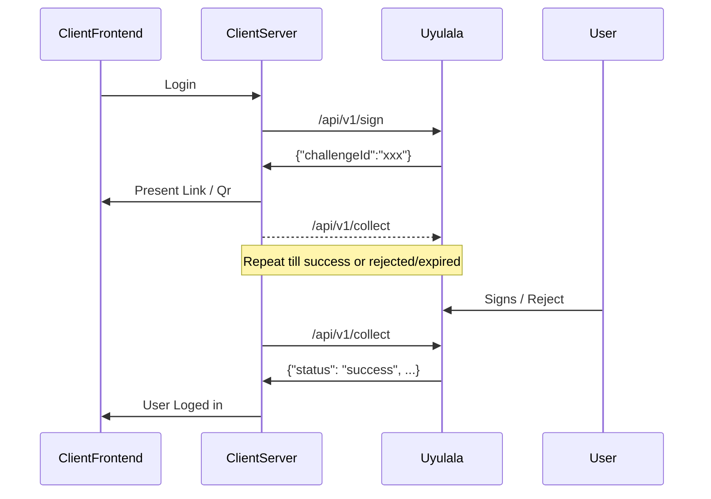

# Uyulala

## Description

Uyulala at it's core is a web based authenticator that only uses `passkeys` as a means of authentication.
Implementing a Bank-ID similar api and a OAuth2 interface, enables uyulala to be used as a IDP for other applications.
It is a simple and secure way to authenticate users without the need for usernames or passwords.

## Features

- [x] Create passkeys
- [x] Create apps
- [x] Authenticate users
- [x] OAuth2 Provider with PKCE support
- [x] Bank-ID similar api
- [x] Consider move the front-end to its own repo (update: It will stay in-repo for simplicity)
- [x] Create a suitable Cross-Origin policy

## Future plans

- [ ] Actually create challenges that are hash-related to the sing-data, allowing "Document signing"
- [ ] Better error handling, logging and documentation
- [ ] Nicer Web UI
- [ ] Replace the websocket-based remote-signer with some webrtc-based solution (eliminate load-balancer issue with
  multiple instances)?
- [ ] Consider adding fictional email to ID Tokens based on user-id eg `ABCDEFG@uyulala.local`
- [ ] Look over any potential useless / missing data with the response from the collect api; it should contain
  everything to validate the signature
- [ ] Should admin apps be able to create users with arbitrary user-ids? (easier to integrate with other solutions?)
- [ ] Make up some configuration / rule system for accepting new keys (eg only allow keys with a certain certification
  level)
- [ ] ....

## Running a local test server

```bash
./scripts/docker-compose.sh up
```

To remove:

```bash 
./scripts/docker-compose.sh down
```

Point a browser at `https://localhost:8080/demo`

## Test use case

1) Protect a grafana instance with uyulala via custom oauth2 settings.
    ```bash
    PROFILE=use-case ./scripts/docker-compose.sh up
    ```
   To remove:
    ```bash
    PROFILE=use-case ./scripts/docker-compose.sh down
    ```
2) Create a user with a registered key by going to `http://localhost/demo`
3) point browser to `http://localhost:3000/`
4) Authenticate with key
5) ????
6) Profit

## BankID flow



## API

The API is split into four parts;

* Client API - Used by applications, protected by client id and client secret (create signature /collect challenges etc)
* Service API - Used by applications with administrative flag set, protected by client id and client secret. Can create
  users and register new keys to users.
* User API [wip] - Used by the user, protected by some JWT issuer. User self-service for managing keys.
* Public API - Used by the web ui and has no authentication (Sign a challenge / get challenge or create an oauth2
  challenge)

---

### Client API

Client authentication is done with Basic authentication using client id as username and client secret as password.
If OAuth2 is used, client id and client secret can be sent both as form data and basic auth.

---
POST `/api/v1/collect`

```bash
curl -u "demo:demo" \
     -H 'Content-Type: application/json' \
     -d '{"challengeId":"challenge-id"}' \
     http://localhost:8080/api/v1/collect
```

This endpoint is similar to the Bank-ID collect in the same sense that it is used to collect a challenge and that the
client should poll this endpoint until it either expires or the user signs the challenge.
This endpoint also doubles as the OAuth2 token endpoint if the `Content-Type` header
is `application/x-www-form-urlencoded`.

Using OAuth2, the code is generated when the user has signed the challenge and the challenge is started with an oauth2
flow.

* `challengeId` - The challenge id to collect

Example request payload

```json
{
  "challengeId": "12ca6a2e-f783-4545-92f2-4d80cb74de45"
}
```

Example signed result:

```json
{
  "challengeId": "12ca6a2e-f783-4545-92f2-4d80cb74de45",
  "userId": "ABCDEFG",
  "status": "signed",
  "signed": "1970-01-01T00:00:00Z",
  "userPresent": true,
  "userVerified": true,
  "publicKey": "",
  "assertionResponse": {
    "clientDataJSON": "",
    "authenticatorData": "",
    "signature": "abasc",
    "userHandle": "abcdef"
  },
  "challenge": "",
  "signatureData": {
    "text": "",
    "data": ""
  }
}
```

Example pending result (Not yet viewed):

```json
{
  "msg": "Challenge has not been signed yet",
  "status": "pending"
}
```

Example viewed result:

```json
{
  "msg": "Challenge has not been signed yet",
  "status": "viewed"
}
```

Example rejected result:

```json
{
  "msg": "Challenge has been rejected",
  "status": "rejected"
}
```

Example collected result

```json
{
  "msg": "Challenge has already been collected",
  "status": "collected"
}
```

Example expired result:

```json
{
  "msg": "Challenge has expired",
  "status": "expired"
}
```

---
POST `/api/v1/sign`

This api is used to create a challenge for the user to sign, also inspired by the Bank-ID api.
The application needs to redirect the user to the authenticator page with the challenge id as a query parameter
eg `http://localhost:8080/authenticator?challengeId=12ca6a2e-f783-4545-92f2-4d80cb74de45`

* `userId` - The user id to sign the challenge for. This can be empty thus creating a challenge anyone with a
  key can sign (think Login). When called with a user id, only the user with that id can sign the challenge.
* `userVerification` - The user verification level required to sign the
  challenge (`required`, `preferred`, `discouraged`)
  The exact implementation of this is up to the authenticator used, but usually some biometric or pin is involved.
* `text` - The text to sign
* `data` - Base64 encoded data to sign (If data is provided, text must be provided)
* `timeout` - The time in seconds before the challenge expires
* `redirect` - The redirect url to send the user to after signing the challenge.
  Must be an url that is registered to the app that created the challenge.

Example request payload:

```json
{
  "userId": "ABCDEFG",
  "userVerification": "required",
  "text": "",
  "data": "",
  "timeout": 300,
  "redirect": "https://example.com/authenticated"
}
```

Example response payload:

```json
{
  "challenge_id": "cbe4748d-2c98-434f-8e72-d32fbbdc86b8"
}
```

---

### Public API

The public api is used by the web ui and has no authentication.

---

GET `/api/v1/challenge/:id`

This api is used to get the challenge data for a specific challenge id.

```bash
curl -H 'Content-Type: application/json' \
     http://localhost:8080/api/v1/challenge/12ca6a2e-f783-4545-92f2-4d80cb74de45
```

example response payload for signing:

```json
{
  "app": {
    "id": "nfh17afcbd1e6add1d1d",
    "name": "demo",
    "created": "2023-11-15T08:25:56Z",
    "description": "",
    "icon": "",
    "idTokenAlg": "RS256",
    "keyId": "asdavafafadqd",
    "admin": false
  },
  "expire": 1700146828,
  "publicKey": {
    "challenge": "<some challenge>",
    "timeout": 300000,
    "rpId": "localhost",
    "allowCredentials": [
      {
        "type": "public-key",
        "id": ""
      },
      {
        "type": "public-key",
        "id": ""
      }
    ],
    "userVerification": "required"
  },
  "type": "webauthn.get"
}
```

example response payload for creating a key:

```json
{
  "app": {
    "id": "nfh17afcbd1e6add1d1d",
    "name": "demo",
    "created": "2023-11-15T08:25:56Z",
    "description": "",
    "icon": "",
    "idTokenAlg": "RS256",
    "keyId": "aaaadbbasdasd",
    "admin": true
  },
  "expire": 1700087418,
  "publicKey": {
    "rp": {
      "name": "uyulala",
      "id": "localhost"
    },
    "user": {
      "name": "Kalle Anka",
      "displayName": "Kalle Anka",
      "id": "ABCDEFG"
    },
    "challenge": "",
    "pubKeyCredParams": [
      {
        "type": "public-key",
        "alg": -7
      },
      {
        "type": "public-key",
        "alg": -35
      },
      {
        "type": "public-key",
        "alg": -36
      },
      {
        "type": "public-key",
        "alg": -257
      },
      {
        "type": "public-key",
        "alg": -258
      },
      {
        "type": "public-key",
        "alg": -259
      },
      {
        "type": "public-key",
        "alg": -37
      },
      {
        "type": "public-key",
        "alg": -38
      },
      {
        "type": "public-key",
        "alg": -39
      },
      {
        "type": "public-key",
        "alg": -8
      }
    ],
    "timeout": 300000,
    "authenticatorSelection": {
      "authenticatorAttachment": "cross-platform",
      "requireResidentKey": true,
      "residentKey": "required",
      "userVerification": "required"
    },
    "attestation": "direct"
  },
  "type": "webauthn.create"
}
```

---

POST `/api/v1/challenge/:id`

This api is used to sign a challenge.

example post data:

```json
{
  "response": {
    "clientDataJSON": "...",
    "authenticatorData": "...",
    "signature": "...",
    "userHandle": "..."
  },
  "rawId": "...",
  "authenticatorAttachment": "cross-platform",
  "type": "public-key",
  "id": "...."
}
```

example response payload:

```json
{
  "redirect": "http://localhost:8080/demo?challengeId=12ca6a2e-f783-4545-92f2-4d80cb74de45"
}
```

---

### Service API

The service api is used to create / delete users and add / remove keys respectively.
Service authentication is same as with the client api, but the client needs the `admin` flag set during creation.

---
GET `/api/v1/service/list/users`

```bash
curl -u "demo:demo" \
     -H 'Content-Type: application/json' \
     http://localhost:8080/api/v1/service/list/users
```

example response payload:

```json
[
  {
    "id": "ea85972bed2a603fb4480ff6980fd530a846",
    "created": "2023-11-15T08:31:02Z",
    "keys": [
      {
        "hash": "<sha hash of key>",
        "key": {
          "ID": "<key id>",
          "PublicKey": "<public key>",
          "AttestationType": "packed",
          "Transport": null,
          "Flags": {
            "UserPresent": true,
            "UserVerified": true,
            "BackupEligible": false,
            "BackupState": false
          },
          "Authenticator": {
            "AAGUID": "<some AAGUID>",
            "SignCount": 14,
            "CloneWarning": false,
            "Attachment": "cross-platform"
          }
        },
        "created": "2023-11-15T08:31:11Z",
        "lastUsed": "2023-11-15T21:31:09Z"
      },
      {
        "hash": "<sha hash of key>",
        "key": {
          "ID": "",
          "PublicKey": "",
          "AttestationType": "none",
          "Transport": null,
          "Flags": {
            "UserPresent": true,
            "UserVerified": true,
            "BackupEligible": true,
            "BackupState": true
          },
          "Authenticator": {
            "AAGUID": "",
            "SignCount": 0,
            "CloneWarning": false,
            "Attachment": "cross-platform"
          }
        },
        "created": "2023-11-15T09:44:09Z",
        "lastUsed": "2023-11-15T09:47:11Z"
      }
    ]
  }
]
```

---
POST `/api/v1/service/create/user`

This api creates a new user and returns a new challenge id that creates the users first key when signed.
Like the sign api, the application needs to redirect the user to the authenticator page with the challenge id as a query
parameter.

```bash
curl -u "demo:demo" \
     -H 'Content-Type: application/json' \
     -d '{"suggestedName": "Kalle Anka", "timeout": 380, "redirect": "http://localhost:8080/demo"}' \
     http://localhost:8080/api/v1/service/create/user
```

example request payload:

```json
{
  "suggestedName": "Kalle Anka",
  "timeout": 380,
  "redirect": "http://localhost:8080/demo"
}
```

example response payload:

```json
{
  "challengeId": "12ca6a2e-f783-4545-92f2-4d80cb74de45"
}
```

---
POST `/api/v1/service/create/key`

This api creates a new key for the user and returns a new challenge id that creates the key associated with the user
when signed.
Like the sign api, the application needs to redirect the user to the authenticator page with the challenge id as a query
parameter.

```bash
curl -u "demo:demo" \
     -H 'Content-Type: application/json' \
     -d '{"userId": "ABCDEFG", "timeout": 380, "redirect": "http://localhost:8080/demo", "suggestedName": "Kalle Anka"}' \
     http://localhost:8080/api/v1/service/create/key
```

example request payload:

```json
{
  "userId": "ABCDEFG",
  "timeout": 380,
  "redirect": "http://localhost:8080/demo",
  "suggestedName": "Kalle Anka"
}
```

example response payload:

```json
{
  "challengeId": "12ca6a2e-f783-4545-92f2-4d80cb74de45"
}
```

---

POST `/api/v1/service/delete/key`

This api deletes a key for the user.

```bash 
curl -u "demo:demo" \
     -H 'Content-Type: application/json' \
     -d '{"userId": "ABCDEFG", "keyHash": "<key id sha hash>"}' \
     http://localhost:8080/api/v1/service/delete/key
```

example request payload:

```json
{
  "userId": "ABCDEFG",
  "keyHash": "<key id sha hash>"
}
```

example response payload:

```json
{
  "status": "deleted"
}
```

---

POST `/api/v1/service/delete/user`

This api deletes a user and all associated keys.

```bash
curl -u "demo:demo" \
     -H 'Content-Type: application/json' \
     -d '{"userId": "ABCDEFG"}' \
     http://localhost:8080/api/v1/service/delete/user
```

example request payload:

```json
{
  "userId": "ABCDEFG"
}
```

example response payload:

```json
{
  "status": "deleted"
}
```
